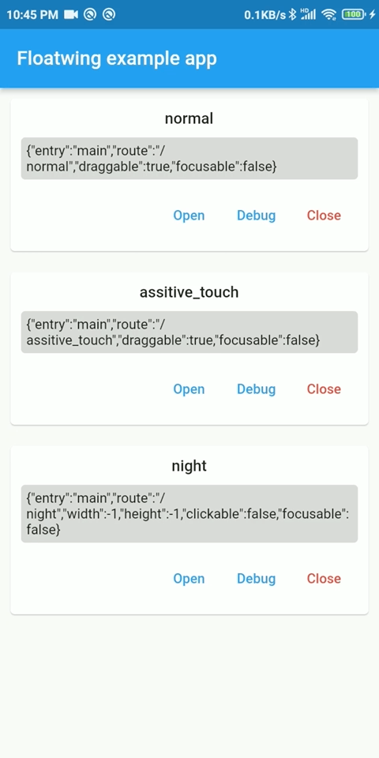
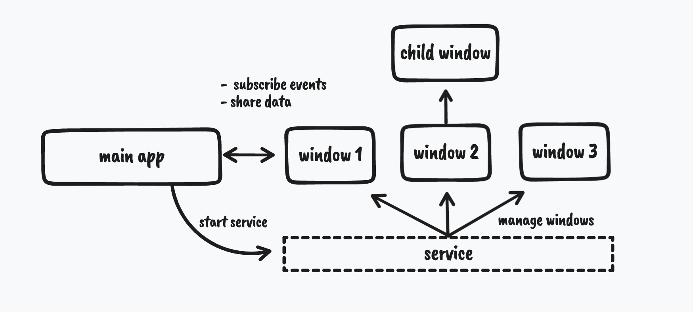

<div align="center">

# flutter_floatwing

[](https://pub.dartlang.org/packages/flutter_floatwing)
[](https://pub.dev/packages/flutter_floatwing/score)
[](https://pub.dev/packages/flutter_floatwing/score)
[](https://pub.dev/packages/flutter_floatwing/score)
[](https://github.com/jiusanzhou/flutter_floatwing/blob/master/LICENSE)

A Flutter plugin that makes it easier to make floating/overlay windows for Android with pure Flutter. **Android only**

</div>

---

## Features

- **Pure Flutter**: you can write your whole overlay windows in pure Flutter.
- **Simple**: at least only 1 line of code to start your overlay window.
- **Auto Resize**: just care about your Flutter widget size, it will auto resize for Android view.
- **Multi-window**: support create multiple overlay windows in one App, and window can has child windows.
- **Communicable**: your main App can talk with windows, and also supported between windows.
- **Event Mechanism**: fire the events of window lifecyle and other actions like drag, you can controll your window more flexible.
- *and more features are coming ...*

## Previews

|Night mode|Simpe example|Assistive touch mock|
|:-:|:-:|:-:|
||||

## Installtion

Open the `pubspec.yaml` file located inside the app folder, and add `flutter_floatwing` under `dependencies`.
```yaml
dependencies:
  flutter_floatwing: <latest_version>
```

The latest version is 
[](https://pub.dartlang.org/packages/flutter_floatwing)

Then you should install it,
- From the terminal: Run `flutter pub get`.
- From Android Studio/IntelliJ: Click Packages get in the action ribbon at the top of `pubspec.yaml`.
- From VS Code: Click Get Packages located in right side of the action ribbon at the top of `pubspec.yaml`.


Or simply add it in your command line:
```bash
flutter pub add flutter_floatwing
```

## Quick Started

We use the android's system alert window to display, so need to add the permission in `AndroidManifest.xml` first:
```xml
    <uses-permission android:name="android.permission.SYSTEM_ALERT_WINDOW" />
```

Add a route for your widget which will be displayed in the overlay window:
```dart
  @override
  Widget build(BuildContext context) {
    return MaterialApp(
      debugShowCheckedModeBanner: false,
      initialRoute: "/",
      routes: {
          "/": (_) => HomePage(),
          // add a route as entrypoint for your overlay window.
          "/my-overlay-window": (_) => MyOverlayWindow(),
      },
    );
  }
```

Before we start the floating window,
we need to check and request the permission, and initialize the `flutter_floatwing` plugin in `initState` or any button's callback function:
```dart
// check and grant the system alert window permission.
FloatwingPlugin().checkPermission().then((v) {
    if (!v) FloatwingPlugin().openPermissionSetting();
});

// initialize the plugin at first.
FloatwingPlugin().initialize();
```

Next to start create and start your overlay window:
```dart
// define window config and start the window from config.
WindowConfig(route: "/my-overlay-window") 
    .to() // create a window object
    .create(start: true); // create the window and start the overlay window.
```

---

Notes:

- `route` is one of 3 ways to define entrypoint for overlay window.
Please check the [Entrypoint section](#entrypoint) for more information.
- See [Usage section](#usage) for more functions.

## Architecture

Before we see how `flutter_floatwing` manage windows in detail,
we need to know some things about the design of the plugin.
- `id` is the unique identifier for the window, and all operations on the window are based on this `id`, you must provide one before creating.
- We consider the first engine created by opening the main application as the `main engine` or `plugin engine`. The other engines created by service are `window engine`.
- Different `engine` are different `threads` and cannot communicate directly.
- Subscribe events of all windows from `main engine` is allowed, it's also allowed to subscribe events of own and child windows in `window engine`. But we can not subscribe events of sibling or parent windows.
- `share` data is the only way to communicate between `window engine` or `plugin engine`, there are no restrictions on it, except that the data needs to be serializable. Which means you can share data from anywhere to anywhere.


A floatwing window object contains: a flutter engine which run a widget by `runApp` and a view which add to window manager.


The whole view hierarchy like below:



## Usage

Before we start how to use `flutter_floatwing` in detail,
let's talk about how the `flutter_floatwing` create a new overlay window:
- First of all we need to start a service as manager by main app.
- Then create window request send to the service.
- In the service, we start the flutter engine with entrypoint.
- Create a new flutter view and attach it to the flutter engine.
- Add the view to android window manager.

### Window & Config

`WindowConfig` contains all configuration for window.
We can use configuration to create a window like below:
```dart
void _createWindow() {
    var config = WindowConfig();
    w = Window(config, id="my-window");
    w.create();
}
```

If you have no need to register event or data handler,
you can just use config to create a window.
```dart
void _createWindow() {
    WindowConfig(id="my-window").create();
}
```

But as you can see, if you want to provide a id for window,
must provide in `WindowConfig`.

If want to register handler, you can use a `to()` function to turn a config to a window at first,
this is every useful when you want to make code simple.
```dart
void _createWindow() {
    WindowConfig(id="my-window").to()
        .on(EventType.WindowCreated, (w, _) {})
        .create();
}
```

#### Lifecyle of Window

- created
- started
- paused
- resumed
- destroy

*TODO*

### Entrypoint

Entrypoint is where the engine execute from. We support 3 modes of configuration:

|Name|Config|How to use|
|:--|:--|:--|
|`route`|`WindowConfig(route: "/my-overlay")`|- Add a route for overlay window in your main routes<br />- Start window with config: `WindowConfig(route: "/my-overlay")`|
|`staic function`|`WindowConfig(callback: myOverlayMain)`|- Define a static function `void Function()` which calling `runApp` to start a widget.<br />- Start window with config: `WindowConfig(callback: myOverlayMain)`|
|`entry-point`|`WindowConfig(entry: "myOverlayMain")`|- First step is same as `staic function`.<br />- Add `@pragma("vm:entry-point")` above the static function.<br />- Start window with config: `WindowConfig(entry: "myOverlayMain")`<br />- *like `static function`, but use string of function name as parameter*|

#### Example for `route`

1. Add route for your overlay widget in the main application.
```dart
  @override
  Widget build(BuildContext context) {
    return MaterialApp(
      debugShowCheckedModeBanner: false,
      initialRoute: "/",
      routes: {
          "/": (_) => HomePage(),
          // add a route as entrypoint for your overlay window.
          "/my-overlay-window": (_) => MyOverlayWindow(),
      },
    );
  }
```

2. Start window with `route` as config.
```dart
    void _startWindow() {
        // define window config and start the window from config.
        WindowConfig(route: "/my-overlay-window") 
            .to() // create a window object
            .create(start: true); // create the window and start the overlay window.
    }
```

#### Example for `static function`

1. Define a static function which called `runApp`
```dart
void myOverlayMain() {
    runApp(MaterialApp(
        home: AssistivePannel(),
    ));
    // or simply use `floatwing` method to inject `MaterialApp`
    // runApp(AssistivePannel().floatwing(app: true));
}
```

2. Start window with `callback` as config.
```dart
    void _startWindow() {
        // define window config and start the window from config.
        WindowConfig(callback: myOverlayMain) 
            .to() // create a window object
            .create(start: true); // create the window and start the overlay window.
    }
```

#### Example for `entry-point`

1. Define as static function which called `runApp` and add `prama`
```dart
@pragma("vm:entry-point")
void myOverlayMain() {
    runApp(MaterialApp(
        home: AssistivePannel(),
    ));
    // or simply use `floatwing` method to inject `MaterialApp`
    // runApp(AssistivePannel().floatwing(app: true));
}
```

2. Start window with `entry` as config.
```dart
    void _startWindow() {
        // define window config and start the window from config.
        WindowConfig(entry: "myOverlayMain") 
            .to() // create a window object
            .create(start: true); // create the window and start the overlay window.
    }
```

### Access window in overlay window

In your window engine, you can access the window object in 2 ways:
- Directly access the cache field of plugin: `FloatwingPlugin().currentWindow`.
- If widget injected by `.floatwing()`, you can take window with `Window.of(context)`.

`FloatwingPlugin().currentWindow` will return `null` unless initialize has been completed.

If you inject `WidgetBuilder` with `.floatwing()`,
then you can access the current window.
It will always return non-value, unless you enable debug with `.floatwing(debug: true)`.

For example, if we want to get the `id` of current window,
we can do it like below:
```dart
/// ...
import 'package:flutter_floatwing/flutter_floatwing.dart';

class _ExampleViewState extends State<ExampleView> {
    Window? w;

    @override
    void initState() {
        super.initState();
        SchedulerBinding.instance?.addPostFrameCallback((_) {
            w = Window.of(context);
            print("my window id is ${w.id}");
        });
    }
}
```

### Subscribe events

We can subscribe events from windows, and trigger actions when events fired.
Events of window will be sent to `main engine`, self `window engine` and the parent `window engine.
Which means you can subscribe events of window from flutter of main application,
overlay window and parent overlay window.

Currently we support events for window lifecycle and drag action.
```dart
enum EventType {
  WindowCreated,
  WindowStarted,
  WindowPaused,
  WindowResumed,
  WindowDestroy,

  WindowDragStart,
  WindowDragging,
  WindowDragEnd,
}
```

*More events type are coming, and contributtions are welcome!*

For example, we want to do something when the window is started,
we can code like below:
```dart
  @override
  void initState() {
    super.initState();

    SchedulerBinding.instance?.addPostFrameCallback((_) {
      w = Window.of(context);
      w?.on(EventType.WindowStarted, (window, _) {
          print("$w has been started.");
      }).on(EventType.WindowDestroy, (window, data) {
          // data is a boolean value, which means that the window
          // are destroyed force or not.
          print("$w has been destroy, force $data");
      });
    });
  }
```

### Share data with windows

Sharing data is the only way to communicate with windows.
We provide a simple way to do this: `window.share(data)`.

For example, if you want to share data to overlay window from main application.

First get the target window in main application,
usually the created one can be used or you can get one from `windows` cache by `id`,
```dart

    Window w;

    void _startWindow() {
        w = WindowConfig(route: "/my-overlay-window").to();
    }

    void _shareData(dynamic data) {
        w.share(data).then((value) {
            // and window can return value.
        });
        // or just take one from cache
        // FloatwingPlugin().windows["default"]?.share(data);
    }
```

If you want to share data with a name, yon can add the name parameter:
``w.share(data, name="name-1")`.

And then you should listen the data in window by register the data handler.
```dart
  @override
  void initState() {
    super.initState();

    SchedulerBinding.instance?.addPostFrameCallback((_) {
      w = Window.of(context);
      w?.onData((source, name, data) async {
          print("get $name data from $source: $data");
      });
    });
  }
```

The function signature of handler is `Future<dynamic> Function(String? source, String? name, dynamic data)`.
- `source` is where the data comes from, `null` if from main application, from window will be the `id` of window.
- `name` is the data name, you can share data for different purposes.
- `data` is the data that you get.
- return some value if you want to do.

There are restrictions for directions of communication, unless you send data to self, which will not be allowed. Which means you can send data as long as you know the id of window. *Currently share to main application is not implemented.*

**Note: The data you are sharing should be serializable.**

## API References

### `FloatwingPlugin` instance

`FloatwingPlugin` is a singleton class that returns the same instance every time it called `FloatwingPlugin()` factory method.


### `WindowConfig` Object

*TODO*

### `Window` Object

*TODO*

### Events

#### Window lifecycle

#### Action


*More events type are coming, and comtributions are welcome!*

## Support

Did you find this plugin useful? Please consider to make a donation to help improve it!

## Contributing

Contributions are always welcome!
